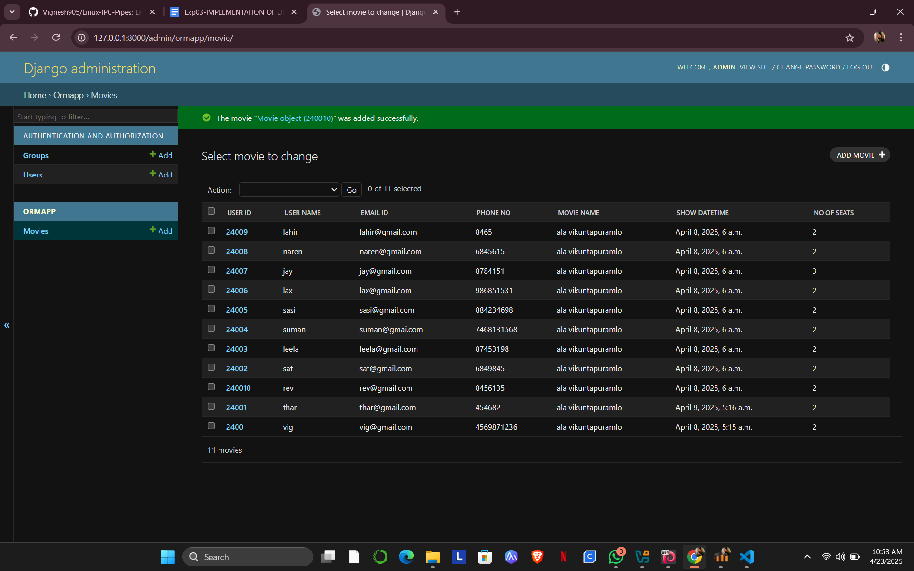

# Ex02 Django ORM Web Application
## Date: 10/04/2025

## AIM
To develop a Django application to store and retrieve data from a Movies Database using Object Relational Mapping(ORM).

## ENTITY RELATIONSHIP DIAGRAM


## DESIGN STEPS

### STEP 1:
Clone the problem from GitHub

### STEP 2:
Create a new app in Django project

### STEP 3:
Enter the code for admin.py and models.py

### STEP 4:
Execute Django admin and create details for 10 books

## PROGRAM
```
from django.db import models
from django.contrib import admin
class movie (models.Model):
    User_id=models.CharField(max_length=20, primary_key=True)
    User_Name=models.CharField(max_length=100)
    Email_ID=models.EmailField()
    Phone_No=models.IntegerField()
    Movie_Name=models.CharField(max_length=100)   
    Show_DateTime=models.DateTimeField()
    No_of_seats=models.IntegerField( )
class MovieAdmin(admin.ModelAdmin):
    list_display=('User_id','User_Name','Email_ID','Phone_No','Movie_Name','Show_DateTime','No_of_seats')
```


## OUTPUT




## RESULT
Thus the program for creating movies database using ORM hass been executed successfully
